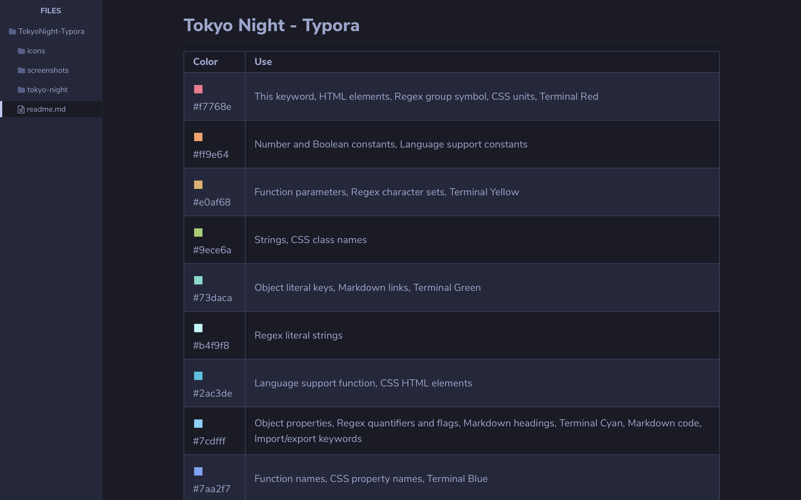

# Tokyo Night - Typora

## Installation

1.  Download the [[latest stable release]]()
2.  Launch Typora and open `Preferences` from the app menu.
3.  Go to the `Appearance` tab, and choose `Open Theme Folder`.
4.  Copy the `tokyo-night.css` file and the `tokyo-night` folder to your Typora theme folder.
5.  Launch or restart Typora and choose the `Tokyo Night` theme from the theme menu.

## Color Palette

| Color                               | Use                                                                                                                     |
| ----------------------------------- | ----------------------------------------------------------------------------------------------------------------------- |
|  #f7768e | This keyword, HTML elements, Regex group symbol, CSS units, Terminal Red                                                |
|  #ff9e64 | Number and Boolean constants, Language support constants                                                                |
|  #e0af68 | Function parameters, Regex character sets, Terminal Yellow                                                              |
|  #9ece6a | Strings, CSS class names                                                                                                |
|  #73daca | Object literal keys, Markdown links, Terminal Green                                                                     |
|  #b4f9f8 | Regex literal strings                                                                                                   |
|  #2ac3de | Language support function, CSS HTML elements                                                                            |
|  #7cdfff | Object properties, Regex quantifiers and flags, Markdown headings, Terminal Cyan, Markdown code, Import/export keywords |
|  #7aa2f7 | Function names, CSS property names, Terminal Blue                                                                       |
|  #bb9af7 | Control Keywords, Storage Types, Regex symbols and operators, HTML Attributes, Terminal Magenta                         |
|  #c0caf5 | Variable, Class names, Terminal White                                                                                   |
|  #a9b1d6 | Editor Foreground                                                                                                       |
|  #9aa5ce | Markdown Text, HTML Text                                                                                                |
|  #cfc9c2 | Parameters inside functions (semantic highlighting only)                                                                |
|  #565f89 | Comments                                                                                                                |
|  #414868 | Terminal Black                                                                                                          |
|  #24283b | Editor Background (Storm)                                                                                               |
|  #1a1b26 | Editor Background (Night)                                                                                               |
